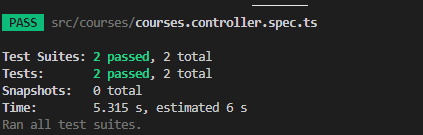

# EXAMEN: Sistema de Gestión de Cursos para Docentes
### Nombres: Alexander Guacan, Mateo Barriga
### NRC: 14956
### Fecha: 06/03/2024


## Instalacion: 
1. Instalacion de dependencias 
``` cmd 
npm install
```
2. Levantamiento del docker: 
``` cmd 
 docker compose up -d
```
3. Inicialiazar el mongo: 

4. Inicialisamos el programa: 
``` cmd 
 npm run start:dev
```
## Pruebas con Thunder Client
### Courses 

### Classes
Asociamos el id de courses para que pueda crear nuestra nueva clase que sera de guitarras

### Subjects 
Asociamos el id de classes para que se pueda crear nuestro tema de la clase

### Test
1. Intalación para los test: 
``` cmd 
    npm test -- --config=jest.config.js
``` 


